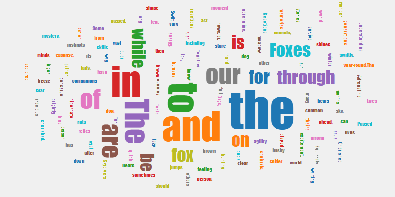

# wordcloud-generator
 A wordcloud generator for nodejs

## Installation
### npm
```bash
npm install wordcloud-generator
```

### yarn
```bash
yarn add wordcloud-generator
```

## Examples



## Usage

### String
```js
import {generate} from "wordcloud-generator";

const wordstring = "The quick brown fox jumps over the lazy dog";
await generate(wordstring, true, "wordcloud.png")
```

### Array of words
```js
import {generate} from "wordcloud-generator";

const words = ["word1", "word2", "word3"];
await generate(words, true, "wordcloud.png")
```

### Map of strings and frequencies
```js
import {generate} from "wordcloud-generator";

const words = new Map()
words.set("abc",10)
words.set("def",20)
words.set("ghi",30)
await generate(words, true, "wordcloud.png")
```
